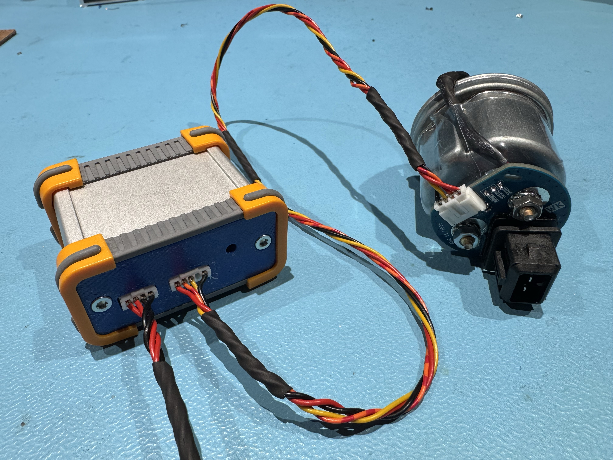
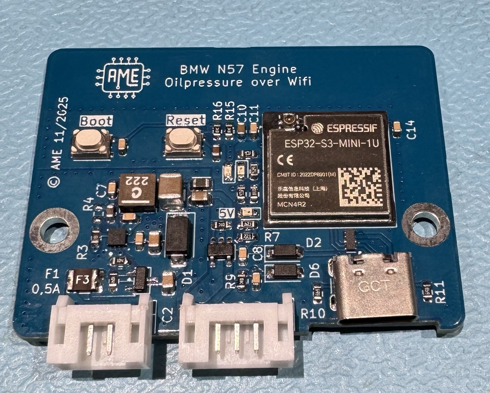
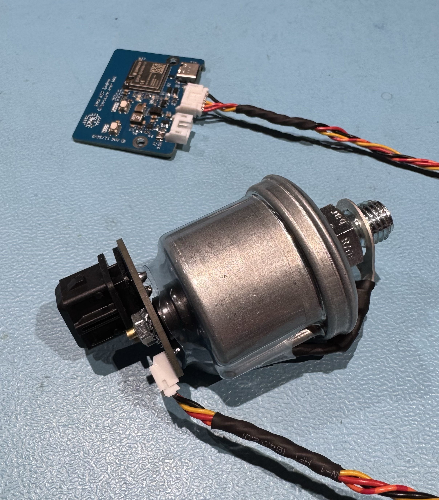
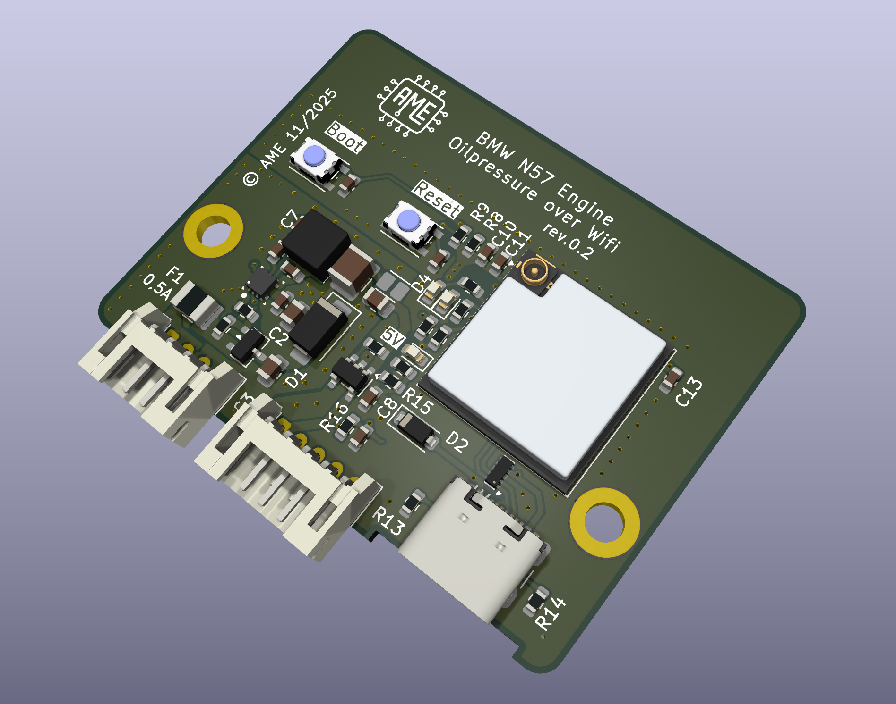
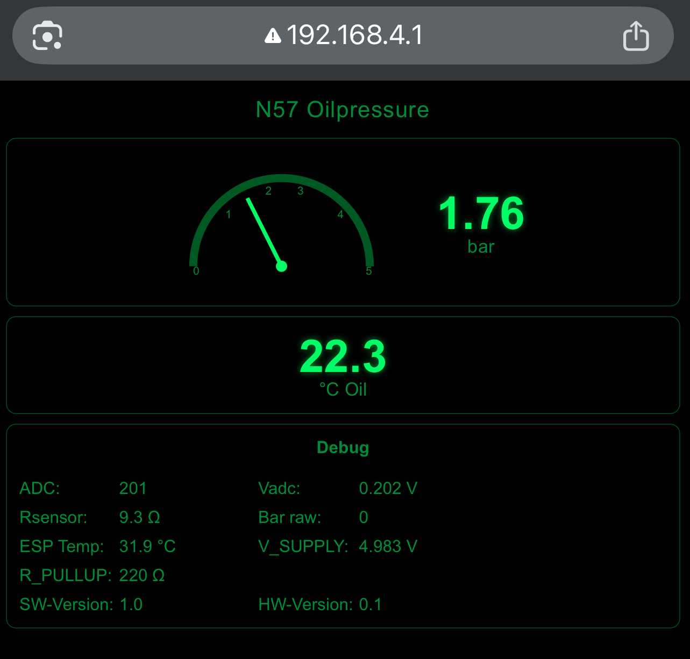

# BMW N57 Oilpressure over WiFi

Öldruck- und Öltemperaturanzeige für BMW N57 Motoren auf Basis eines ESP32  
mit eigenem PCB, VDO-Öldrucksensor und Web-UI (Dark-OLED / Kombiinstrument-Stil).

---
## 📸 Projektüberblick

### Komplettsystem – Steuergerät & Sensor


Das System besteht aus einem ESP32-Steuergerät und einer separaten
Sensorplatine, die direkt am VDO-Öldruckgeber montiert ist.  
Die Anzeige erfolgt drahtlos über ein integriertes Web-Interface.

---
### Steuergerät (ESP32-S3 Mini)


## Features

- Messung des **Öldrucks (0–5 bar)** über VDO Druckgeber  
- Messung der **Öltemperatur** (DS18B20)  
- **ESP32 Web-Interface** (kein Internet erforderlich)  
- Automatisches **Tag-/Nacht-Design** (Grün / BMW-Amber)  
- Analoge Rundinstrument-Anzeige (Skala 0–5 bar)  
- Warnlogik:  
  - Öldruck < 0,8 bar → blinkende Warnanzeige  
  - Öltemperatur > Schwellwert → Warnfarbe  
- Integriertes **Debug-Overlay** (ADC, Spannung, Widerstände, Versionen)

---

### VDO Öldruckgeber montiert


OEM-naher VDO-Öldruckgeber mit integrierter Elektronik und KFZ-tauglicher
Montage.

---

## Projektstruktur

```text
BMW_N57_OILPRESSURE_OVER_WIFI/
├─ firmware/          ESP32 Firmware (PlatformIO)
├─ pcb_main/          Hauptplatine (KiCad)
├─ pcb_sensor/        Sensorplatine (KiCad)
├─ docs/              Datenblätter & Dokumentation
└─ README.md
```

---
### 3D-Render – Hauptplatine


3D-Ansicht der Hauptplatine (KiCad).  
Kompaktes, robustes Layout für den Einsatz im Fahrzeug.

## Hardware

- ESP32 (ESP32-S3 mini)
- VDO Öldruckgeber 0–5 bar (M12x1.5)
- DS18B20 Temperatursensor
- Step‑Down‑Regler 
- Versorgung Sensor: **≈ 5,0 V**
- USB‑C zum flaschen

## 🚦 Status-LEDs

| LED | Funktion |
|----|---------|
| **LED orange** | Leuchtet dauerhaft, wenn der WiFi-Access-Point aktiv ist |
| **LED blau** | Leuchtet, sobald ein Client (Smartphone / Browser) verbunden ist |

---

## Messprinzip

Der VDO-Öldruckgeber arbeitet als Widerstand gegen Masse.  
Die Messung erfolgt über einen Spannungsteiler:

```text
+5V → R_PULLUP → Rsensor → GND
```

Die Firmware berechnet:
1. ADC → Spannung (kalibriert)
2. Spannung → Rsensor
3. Rsensor → bar (VDO-Kennlinie via LUT + Interpolation)
4. IIR-Filter zur Glättung

---
### Web-UI (Live-Anzeige)


## Web-UI

- Zugriff über ESP32 Access Point
- Anzeige:
  - Öldruck (bar)
  - Öltemperatur (°C)
  - Analoges Rundinstrument
- Debug-Bereich mit:
  - ADC
  - Vadc
  - Rsensor
  - Bar raw
  - ESP-Temperatur
  - Versorgungsspannung
  - Pullup-Widerstand
  - SW- / HW-Version

---

## Status

- Hardware: **funktionsfähig**
- Firmware: **stabil**
- Kalibrierung: **ADC + Versorgungsspannung kalibriert**
- Projektstatus: **aktiv in Entwicklung**

---

## Hinweis

Dieses Projekt ist ein **DIY-Projekt** und ersetzt keine serienmäßigen
Sicherheitsfunktionen des Fahrzeugs.

Nutzung auf eigene Verantwortung.

---

## Lizenz

Noch nicht festgelegt.
